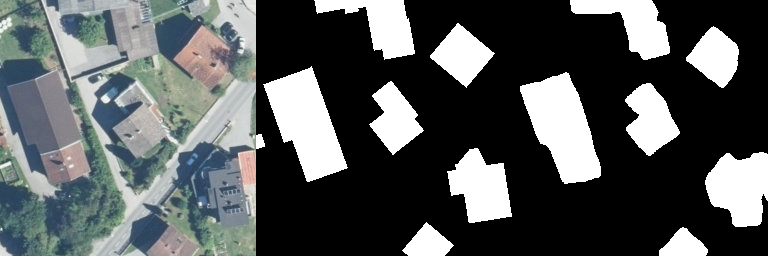

# Tensorflow 2.1 Segmentation pipeline implementation from scratch

---

## Process with Cityscape datasets
### Cityscape data with HRNet

cityscape dataset (https://www.cityscapes-dataset.com/)  
HRNet (https://arxiv.org/pdf/1908.07919.pdf)  

HRNetV2W48 model  
mIOU 70.31% (without pre-trained backbone)  
  
| Input image | Ground truth | Segmentation result |  
  
  
  
  

---   

## Process with Inria datasets
### Inria dataset with *Modified HRNet  
inria dataset (https://project.inria.fr/aerialimagelabeling/leaderboard/)  
HRNet (https://arxiv.org/pdf/1908.07919.pdf)  
*Modify HRNet's layers for satellite image processing
  
| Input image | Ground truth | Segmentation result |  
  
  
  
  

Foreground IOU : 75.63% (without post-processing)
